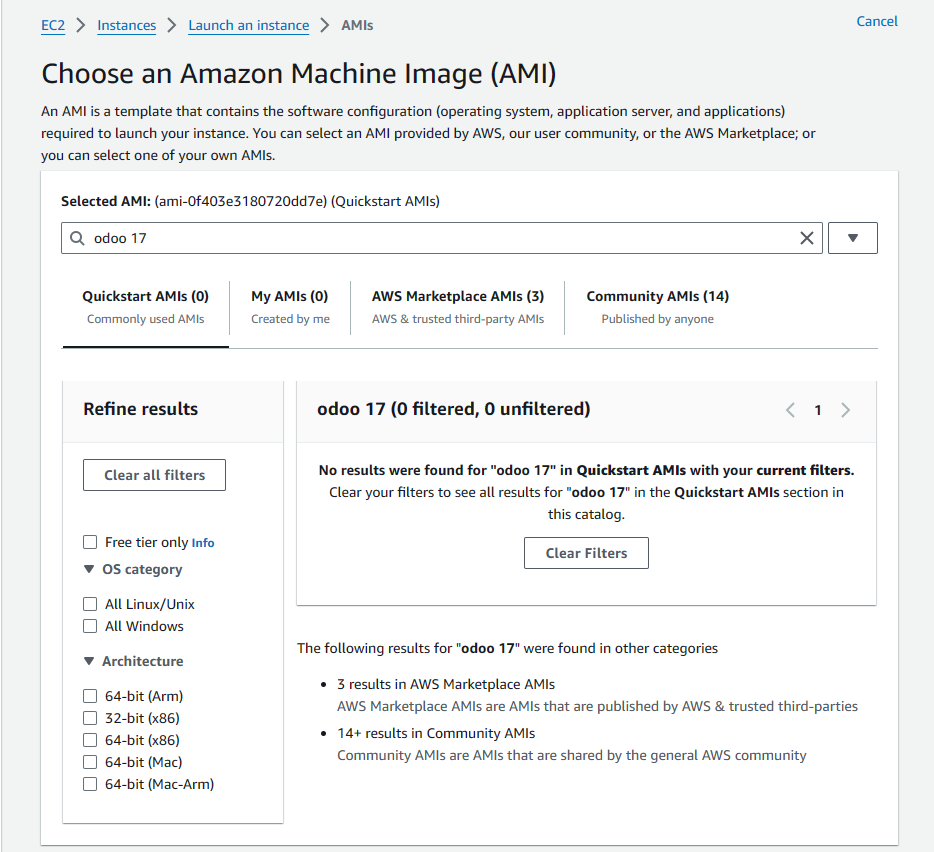

<!-- PROJECT LOGO -->
 

  
  
  <h3 align="center">Odoo-17 Deployment:</h3>

  

    Comprehensive guide for deploying Odoo 17 on AWS EC2 using the Bitnami AMI!
     
    <a href="https://docs.bitnami.com/aws/"><strong>Explore the docs »</strong></a>
     
     
    <a href="https://bitnami.com/stack/odoo/cloud/aws">DEPLOYMENT OFFERING</a>
    ·
    <a href="https://github.com/bitnami/vms">Report Bug</a>
    ·
    <a href="https://docs.bitnami.com/aws/faq/">AWS FAQ</a>
  

  

  
# Product Overview

Odoo is an open source Enterprise Resource Planning (ERP) and Customer Relationship Management (CRM) platform that can consolidate a variety of business operations, from supply chain and project management to accounting and HR, into one system. It is supported by a community of over 20,000 contributors.

If you’re new to the cloud, the easiest way to get started with Amazon Web Services is with Bitnami. Bitnami provides pre-packaged application images for AWS Cloud servers, so that you can get productive with your new server immediately. You can access and launch these images in three ways:

Through the [AWS Marketplace](https://aws.amazon.com/marketplace), Amazon’s online application library;

Through the [AWS Console](https://console.aws.amazon.com/), Amazon’s online dashboard for AWS users;

Through [Amazon Lightsail](https://amazonlightsail.com/), Amazon’s virtual private servers.

In this tutorial, I’ll walk you, step by step, through the process of using the AWS Console to create and provision a new AWS cloud server. And since AWS offers a Free Tier valid for 12 months, you’ll have plenty of time to experiment with your server and Bitnami images without worrying about being billed for usage.

## Getting Started

1. Sign in to your [AWS account](https://console.aws.amazon.com/console/home)

2. Go to your AWS Management Console

3. Search for EC2 landing page

4. Click on Launch instance

5. Name your Virtual Server (something like "Odoo Server")

6. On Application and OS Images (Amazon Machine Image) section search for Odoo 17

 

### Prerequisites

Requirements for the software and other tools to build, test and push 
- [Example 1](https://www.example.com)
- [Example 2](https://www.example.com)

### Installing

A step by step series of examples that tell you how to get a development
environment running

Say what the step will be

    Give the example

And repeat

    until finished

End with an example of getting some data out of the system or using it
for a little demo

## Running the tests

Explain how to run the automated tests for this system

### Sample Tests

Explain what these tests test and why

    Give an example

### Style test

Checks if the best practices and the right coding style has been used.

    Give an example

## Deployment

Add additional notes to deploy this on a live system

## Built With

  - [Contributor Covenant](https://www.contributor-covenant.org/) - Used
    for the Code of Conduct
  - [Creative Commons](https://creativecommons.org/) - Used to choose
    the license

## Contributing

Please read [CONTRIBUTING.md](CONTRIBUTING.md) for details on our code
of conduct, and the process for submitting pull requests to us.

## Versioning

We use [Semantic Versioning](http://semver.org/) for versioning. For the versions
available, see the [tags on this
repository](https://github.com/PurpleBooth/a-good-readme-template/tags).

## Authors

  - **Billie Thompson** - *Provided README Template* -
    [PurpleBooth](https://github.com/PurpleBooth)

See also the list of
[contributors](https://github.com/PurpleBooth/a-good-readme-template/contributors)
who participated in this project.

## License

This project is licensed under the [CC0 1.0 Universal](LICENSE.md)
Creative Commons License - see the [LICENSE.md](LICENSE.md) file for
details

## Acknowledgments

  - Hat tip to anyone whose code is used
  - Inspiration
  - etc

